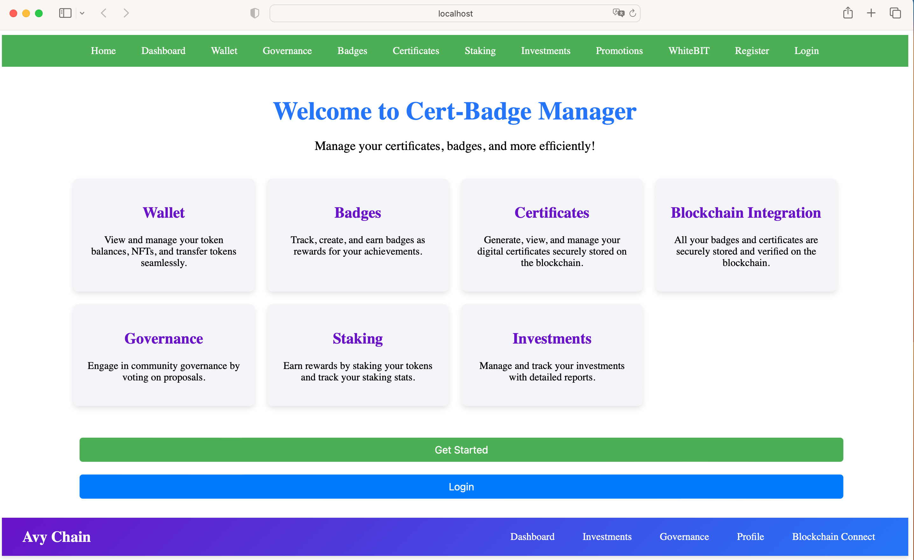
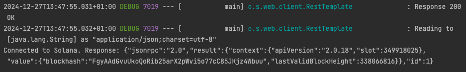
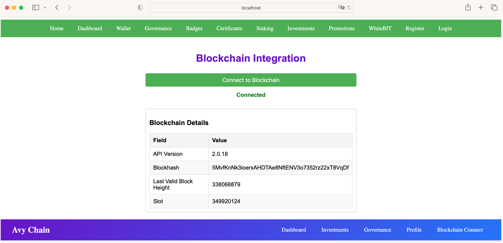

# cert-badge-manager
Product Requirement Document (PRD)

1. General Information About the Project

**Project Name:** Blockchain Badge Certification System

**Project Objective:**
The primary goal of the project is to create a robust blockchain-based system for issuing and managing NFT badges and certifications. These badges serve as immutable proof of achievements or qualifications and can be seamlessly integrated with various platforms, including WhiteBit, to enhance their utility and accessibility. By leveraging blockchain technology, we aim to ensure transparency, security, and user trust.

**Target Audience:**

##Developers: Building and maintaining integrations and systems.

##Platform Users: Individuals earning badges and certifications.

##Organizations/Companies: Issuing badges and utilizing the system for internal and external recognition programs.

**2. Completed Work**

**Description of Completed Tasks:**

Development of an initial token on the Solana blockchain.

Creation of foundational smart contracts for NFT badges.

Implementation of a Minimum Viable Product (MVP) for badge creation and issuance.

**List of Accomplished Tasks:**

Built and deployed token contract on the Solana blockchain.

Designed the basic UI for badge creation.

Conducted initial testing for badge issuance and validation.

**GitHub Link:**

Repository containing all completed tasks and code:
GitHub Repository

**3. Current Status of the Project**

**Technical Progress:**

Functional smart contracts for badge creation and validation are in place.

MVP is operational with limited functionality.

Integration with WhiteBit is in the initial testing phase.

**Identified Issues:**

Technical details for full integration with WhiteBit are pending clarification.

Lack of comprehensive documentation for external developers.

**Ongoing Tasks:**

Finalizing integration of the token with WhiteBit.

Expanding the functionality of NFT badges.

Preparing for a system demonstration.

**4. Future Plan**

Short-Term Goals (1-2 Weeks):

Complete the integration with WhiteBit.

Finalize the UI and workflow for badge creation and management.

Prepare technical documentation for a demonstration.

**Long-Term Goals:**

Scale the system to handle larger user bases.

Establish additional partnerships for badge recognition and use cases.

Launch the platform to a wider audience.

**Potential Risks:**

Delays in receiving technical specifications from integration partners.

Lack of user familiarity with blockchain technology.

**5. Technical Details**

Technologies and Platforms:

**Blockchain:** Solana

**Integration Platform:** WhiteBit

**Development Tools:** Rust for smart contracts, JavaScript for front-end.

**System Architecture:**

Smart Contract Layer: Manages badge issuance and validation.

**API Layer:** Facilitates communication between the blockchain and external platforms.

**User Interface:** Simplified dashboard for badge management.

**Security Requirements:**

Secure storage of private keys and sensitive user data.

Multi-signature wallets for organizational badge issuance.

Regular audits of smart contracts.

**6. References and Links**

**GitHub Repository:** https:
**WhiteBit Documentation:** https:
**Blockchain Security Best Practices:** https://101blockchains.com